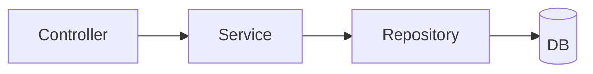

---
# try also 'default' to start simple
theme: default
# random image from a curated Unsplash collection by Anthony
# like them? see https://unsplash.com/collections/94734566/slidev
# background: https://cover.sli.dev
# some information about your slides, markdown enabled
title: Spring Boot Integration Tests
info: |
# apply any unocss classes to the current slide
class: text-center
# https://sli.dev/custom/highlighters.html
highlighter: shiki
# https://sli.dev/guide/drawing
drawings:
  persist: false
# slide transition: https://sli.dev/guide/animations#slide-transitions
transition: slide-left
# enable MDC Syntax: https://sli.dev/guide/syntax#mdc-syntax
mdc: true
---

# Integration Tests

Jiandong Ma

<div class="abs-br m-6 flex gap-2">
  <button @click="$slidev.nav.openInEditor()" title="Open in Editor" class="text-xl slidev-icon-btn opacity-50 !border-none !hover:text-white">
    <carbon:edit />
  </button>
  <a href="https://github.com/mjd507/Sildes" target="_blank" alt="GitHub" title="Open in GitHub"
    class="text-xl slidev-icon-btn opacity-50 !border-none !hover:text-white">
    <carbon-logo-github />
  </a>
</div>

<!--
The last comment block of each slide will be treated as slide notes. It will be visible and editable in Presenter Mode along with the slide. [Read more in the docs](https://sli.dev/guide/syntax.html#notes)
-->

---
transition: slide-left
---

# Definition

Integration Test can be board or narrow. depending on our roles.


<div v-click>

- **Broad Integration Tests**

  - Need <span v-mark.orange="4">the whole application running</span> 
  - Exercise the application through UI or Http
  - Also called system tests or end-to-end tests

</div v-click>


<v-click>

- **Narrow Integration Tests**

  - Excercise <span v-mark.red="3"> only part of the application</span>
  - Use test doubles for some components or external services
  - Also called component tests or service test.

</v-click>

<!--
You can have `style` tag in markdown to override the style for the current page.
Learn more: https://sli.dev/guide/syntax#embedded-styles
-->

<style>
h1 {
  background-color: #2B90B6;
  background-image: linear-gradient(45deg, #4EC5D4 10%, #146b8c 20%);
  background-size: 100%;
  -webkit-background-clip: text;
  -moz-background-clip: text;
  -webkit-text-fill-color: transparent;
  -moz-text-fill-color: transparent;
}
</style>

<!--
Here is another comment.
-->

---
transition: slide-left
---

# Spring Boot Integration Tests 

<div v-click>


</div v-click>

<div v-click>
Convention over Configuration.
</div v-click>

---
transition: slide-left
---

# Demo 1 - MockMvc 

````md magic-move

```java {all|1} 
@SpringBootTest
@AutoConfigureMockMvc
public class BookControllerTest {
    @Autowired MockMvc mockMvc;

    @SneakyThrows
    @Test
    void test_visit_permitted_by_path() {
        mockMvc.perform(.get("/book"))
                .andExpect(status().isOk());
    }
}
```

```java {1}
@SpringBootTest(classes= {BookController.class })
@AutoConfigureMockMvc
public class BookControllerTest {
    @Autowired MockMvc mockMvc;

    @SneakyThrows
    @Test
    void test_visit_permitted_by_path() {
        mockMvc.perform(.get("/book"))
                .andExpect(status().isOk());
    }
}
```

```java {1}
@WebMvcTest(value= {BookController.class })
//@AutoConfigureMockMvc
public class BookControllerTest {
    @Autowired MockMvc mockMvc;

    @SneakyThrows
    @Test
    void test_visit_permitted_by_path() {
        mockMvc.perform(.get("/book"))
                .andExpect(status().isOk());
    }
}
```

````

---
transition: slide-up
---

# Demo 2 - SecurityConfig

```java
@EnableWebSecurity
@Configuration
public class WebSecurityConfig {

    @Bean
    public RequestMatcher tokenMatcher() {
        return request -> {
            String authentication = request.getHeader("Authentication");
            return Objects.equals(authentication, "abc");
        };
    }

    @Bean
    public SecurityFilterChain securityFilterChain(HttpSecurity http) throws Exception {
        http.authorizeHttpRequests(authorize ->
          authorize
            .requestMatchers(new AntPathRequestMatcher("/public/**")).permitAll()
            .requestMatchers(tokenMatcher()).permitAll()
            .anyRequest().authenticated()
        );
        return http.build();
    }
}
```

---
transition: slide-left
---

```java {monaco}
@WebMvcTest(value = {SecurityController.class})
@ImportAutoConfiguration(classes = {WebSecurityConfig.class})
public class WebSecurityConfigTest {

    @Autowired MockMvc mockMvc;

    @SneakyThrows
    @Test
    void test_visit_permitted_by_path() {
        mockMvc.perform(get("/public/content"))
                .andExpect(status().isOk());
    }

    @SneakyThrows
    @Test
    void test_visit_permitted_by_token() {
        mockMvc.perform(.get("/private/content")
                        .header("Authentication", "abc"))
                .andExpect(status().isOk());
    }

    @SneakyThrows
    @Test
    void test_visit_rejected() {
        mockMvc.perform(.get("/private/content"))
                .andExpect(status().is4xxClientError());
    }
}

```


---
transition: slide-left
---
# Demo 3 - Spring Integration


---
transition: slide-left
---
# Demo 4 - RestTemplate


---
transition: slide-left
---
# Demo 5 - Other Samples


---
transition: slide-left
---
# Test Slices

<div v-click>
one principle for integration tests:
</div v-click>

<div v-click>
the fewer resources you load, the better.
</div v-click>

<div v-click>
spring official test slices
https://docs.spring.io/spring-boot/appendix/test-auto-configuration/slices.html
</div v-click>


---
layout: center
class: text-center
---

# Thank you
